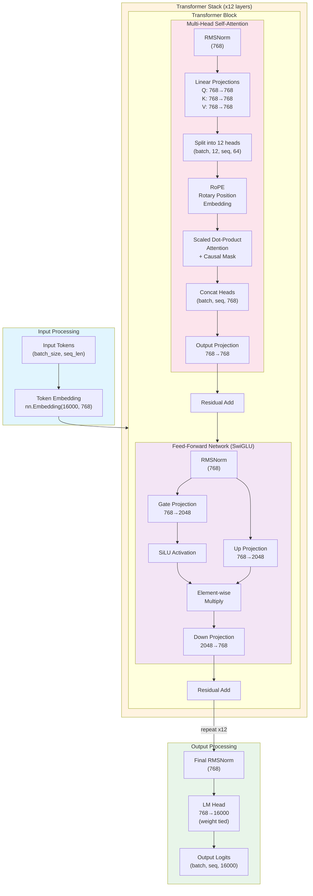
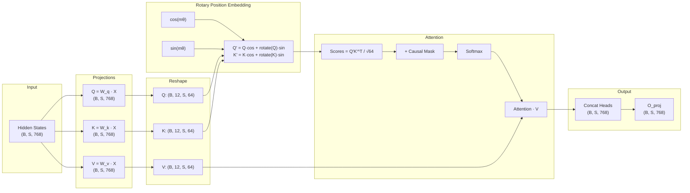
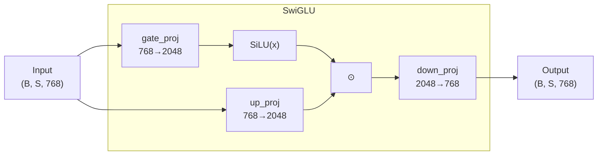
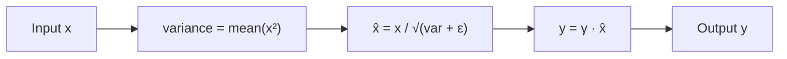
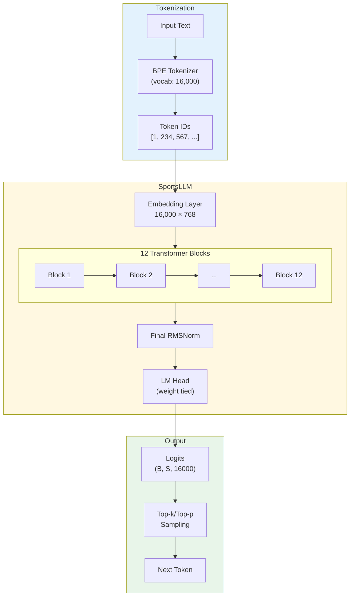

# Sports LLM Model Architecture

## Overview

The Sports LLM is a decoder-only Transformer model based on the LLaMA architecture, optimized for sports domain text generation.

## Model Configurations

| Config | Parameters | Layers | Heads | Hidden Dim | Intermediate | Context |
|--------|------------|--------|-------|------------|--------------|---------|
| Small  | ~125M      | 12     | 12    | 768        | 2048         | 2048    |
| Medium | ~350M      | 24     | 16    | 1024       | 4096         | 2048    |
| Large  | ~760M      | 24     | 16    | 1536       | 6144         | 4096    |

## Small Model (~125M) - Detailed Specifications

```
vocab_size:              16,000 (or 32,000)
hidden_size:             768
intermediate_size:       2,048
num_hidden_layers:       12
num_attention_heads:     12
num_key_value_heads:     12
head_dim:                64 (768 / 12)
max_position_embeddings: 2,048
rms_norm_eps:            1e-6
rope_theta:              10,000.0
```

## Architecture Diagram



## Detailed Component Diagrams

### Multi-Head Attention



### SwiGLU Feed-Forward Network



### RMSNorm



## Full Model Flow



## Parameter Count Breakdown (Small Model)

| Component | Shape | Parameters |
|-----------|-------|------------|
| Token Embedding | 16,000 × 768 | 12,288,000 |
| **Per Transformer Block:** | | |
| - Q projection | 768 × 768 | 589,824 |
| - K projection | 768 × 768 | 589,824 |
| - V projection | 768 × 768 | 589,824 |
| - O projection | 768 × 768 | 589,824 |
| - Gate projection | 768 × 2048 | 1,572,864 |
| - Up projection | 768 × 2048 | 1,572,864 |
| - Down projection | 2048 × 768 | 1,572,864 |
| - Input LayerNorm | 768 | 768 |
| - Post-Attn LayerNorm | 768 | 768 |
| **Block Total** | | 7,079,424 |
| **12 Blocks Total** | | 84,953,088 |
| Final RMSNorm | 768 | 768 |
| LM Head | (tied with embedding) | 0 |
| **Total Parameters** | | **~97M** |

*Note: With vocab_size=32,000, embedding adds ~24.6M params, totaling ~125M*

## Key Architectural Features

### 1. RoPE (Rotary Position Embedding)
- Encodes position information directly into attention computation
- Enables better generalization to longer sequences
- No learned position embeddings needed

### 2. SwiGLU Activation
- Gated Linear Unit with SiLU (Swish) activation
- Formula: `SwiGLU(x) = SiLU(gate(x)) ⊙ up(x)`
- Better performance than standard ReLU/GELU FFN

### 3. RMSNorm (Root Mean Square Normalization)
- Simpler and faster than LayerNorm
- Only scales, no centering: `y = x / RMS(x) * γ`
- Pre-normalization (before attention/FFN)

### 4. Weight Tying
- LM head shares weights with token embedding
- Reduces parameters and improves coherence

### 5. Causal Masking
- Lower triangular attention mask
- Prevents attending to future tokens
- Essential for autoregressive generation

## Training Configuration

```yaml
# Hyperparameters used for training
max_steps: 5000
batch_size: 4
gradient_accumulation_steps: 4
effective_batch_size: 16
learning_rate: 3e-4
warmup_steps: 50
max_seq_length: 512
optimizer: AdamW
weight_decay: 0.1
mixed_precision: fp16
```

## Inference Configuration

```yaml
# Generation parameters
max_new_tokens: 100
temperature: 0.7
top_k: 50
top_p: 0.9
do_sample: true
```
